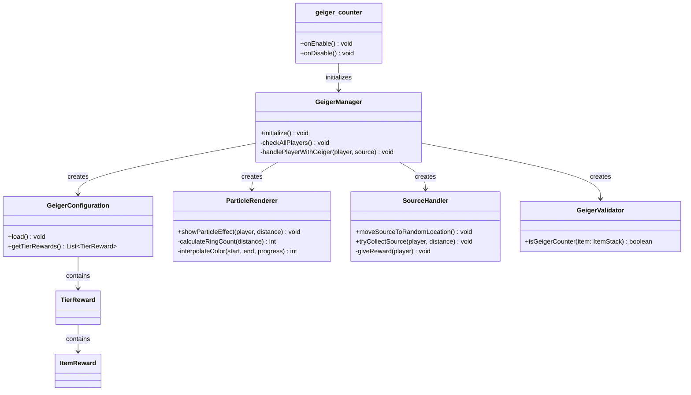

# GeigerCounter

**A Minecraft server plugin that turns exploration into a treasure hunt — track a hidden radioactive source by particle signal and claim tiered loot.**


Built for the [TFMC](https://www.patreon.com/c/TFMCRP) roleplay server, where it runs in production as a server-wide scavenger-hunt event mechanic.

---

## What It Does

Hold a **Geiger Counter** item and the world starts talking back: particle rings around you shift in color and count based on how close you are to a hidden radioactive source. Walk it down, collect the source, and a weighted loot table decides your prize — anywhere from common food to mythical skin scrolls. The counter burns out, the source relocates, and the hunt begins again.

| | |
|---|---|
| **Signal tracking** | Particle rings guide players toward a randomly placed source — more rings and brighter colors mean closer |
| **Tiered rewards** | 6 rarity levels (Common → Mythical) with fully weighted drop chances |
| **Self-resetting hunt** | Collecting the source relocates it to a new random spot in the search area |
| **Consumable gameplay** | The Geiger Counter "runs out of charge" on success, becoming a **Dead Geiger Counter** |
| **Config-driven design** | Search area, detection ranges, particle colors, and reward pools all live in `config.yml` |

## How It Works

A repeating task checks every online player. For each player holding a Geiger Counter:

1. The horizontal distance to the radioactive source is calculated (Y is ignored, so the signal works across terrain height).
2. That distance is mapped to a particle configuration — ring count (1–3) from distance thresholds, and a color interpolated along a two-stage gradient (dark purple → purple far away, purple → white up close).
3. The rings spawn around the player as a live "signal strength" readout.
4. Within collection distance (20 blocks by default), the source is collected automatically: a tier is rolled by weight, a random item from that tier is granted, the counter is swapped for its dead version, and the source moves to a fresh random location.

## Architecture

Small, deliberate footprint — each class has one job:

```
src/main/java/tfmc/justin/
├── geiger_counter.java                # Entry point: wiring, lifecycle
├── config/
│   └── GeigerConfiguration.java       # config.yml loading: area, ranges, colors, rewards
├── handlers/
│   ├── ParticleRenderer.java          # Distance → ring count + color gradient rendering
│   └── SourceHandler.java             # Source placement, collection, reward rolls
├── listeners/
│   └── PlayerListener.java            # Player event hooks
├── managers/
│   ├── GeigerManager.java             # Periodic player checks, component coordination
│   └── PluginManager.java             # Plugin-wide initialization
├── models/
│   ├── TierReward.java                # Reward tier: weight + item pool
│   └── ItemReward.java                # Single reward: item path + amount
├── utils/
│   └── Utils.java                     # Shared helpers
└── validators/
    └── GeigerValidator.java           # Is this item a Geiger Counter? (TLibs paths)
```



*Full diagram: [UML-Diagram.mmd](UML-Diagram.mmd)*

### Design decisions

- **Configuration over code** — the entire hunt is data: search area, thresholds, gradient colors, messages, and every reward pool are YAML edits, not releases.
- **One scheduler task, not per-player listeners** — a single periodic check scans players and short-circuits for anyone not holding a counter, keeping the hot path cheap.
- **Abstraction over item plugins** — items and rewards resolve through the TLibs `ItemAPI`, so one config format covers MMOItems, ItemsAdder, and vanilla items with a one-character prefix.

## Installation

1. Drop `geiger_counter-1.0.0.jar` into your server's `plugins/` folder
2. Install **TLibs** (required). **MMOItems** / **ItemsAdder** are optional item sources
3. Restart the server (or load with PlugManX)
4. Configure `plugins/geiger_counter/config.yml` — the source spawns at a random location within the configured area

### Requirements

| Dependency | Required |
|---|---|
| [Paper](https://papermc.io/) 1.21+ | Yes |
| Java 21 | Yes |
| [TLibs](https://www.spigotmc.org/resources/tlibs.127713/) | Yes |
| [MMOItems](https://www.spigotmc.org/resources/mmoitems-premium.39267/) | Optional |
| [ItemsAdder](https://itemsadder.com/) | Optional |

## Usage

1. Obtain a **Geiger Counter** item (via TLibs/MMOItems/ItemsAdder)
2. Hold it — particle rings appear, showing signal strength
3. Follow the signal: more rings and lighter colors mean you're getting closer
4. Get within **20 blocks** (default) to collect the source automatically
5. Receive a reward rolled from the tiered loot pool; the counter becomes a **Dead Geiger Counter** and the source relocates

### Reading the signal

| Signal | Meaning |
|---|---|
| **3 rings** | Within 100 blocks — very close |
| **2 rings** | Within 300 blocks — close |
| **1 ring** | Beyond 300 blocks — far |
| **White** | Very close (0–200 blocks) |
| **Purple → dark purple** | Far away (200–2500 blocks) |

## Configuration

```yaml
# Source location settings
source:
  world: TFMC_S2          # World where source spawns
  top-left:               # Search area corner 1
    x: -1000.0
    z: -1000.0
  bottom-right:           # Search area corner 2
    x: 1000.0
    z: 1000.0

# Detection settings
detection:
  collection-distance: 20.0           # Distance to collect source (blocks)
  max-detection-distance: 2500.0      # Maximum detection range
  close-range-threshold: 200.0        # Distance threshold for color shift
  ring-thresholds:
    three-rings: 100.0    # 3 rings when closer than this
    two-rings: 300.0      # 2 rings when closer than this (else 1)

# Particle effect colors (RGB: 0-255)
colors:
  close-range:
    start: { red: 255, green: 255, blue: 255 }  # White (closest)
    end: { red: 255, green: 0, blue: 255 }      # Purple (threshold)
  far-range:
    start: { red: 255, green: 0, blue: 255 }    # Purple (threshold)
    end: { red: 17, green: 0, blue: 17 }        # Dark Purple (farthest)

# Reward tiers with weighted chances
drops:
  tier-weights:
    common: 45      # 45%
    uncommon: 30    # 30%
    rare: 15        # 15%
    epic: 7         # 7%
    legendary: 2.5  # 2.5%
    mythical: 0.5   # 0.5%

  tiers:
    common:
      - "m.FOODS.SAUSAGE:32"
      - "v.raw_iron_block:32"
      - "ia.tfmc:mythril_ingot"
    # ... (see config.yml for full reward lists)

# Messages
messages:
  found-source: "&#AA00FFYou have found the source of Arcane Radiation! &#FFFF00The source has moved."
  dead-geiger: "&7Your Arcane Trace Detector has run out of fuel."
```

**Item path formats**

| Source | Format | Example |
|---|---|---|
| MMOItems | `m.category.item_id` | `m.FOODS.SAUSAGE` |
| ItemsAdder | `ia.namespace:item_id` | `ia.tfmc:mythril_ingot` |
| Vanilla | `v.material` | `v.raw_iron_block` |

**Reward tiers**

| Tier | Weight | Typical Rewards |
|---|---|---|
| **Common** | 45% | Food, basic materials, raw iron |
| **Uncommon** | 30% | Rare fragments, repair kits, research items |
| **Rare** | 15% | Advanced fragments, medium repair kits |
| **Epic** | 7% | Runestones, trial keys, strong repair kits |
| **Legendary** | 2.5% | Legendary materials, magic repair kits, gemstone pouches |
| **Mythical** | 0.5% | Item skin scrolls, mythical pouches, rare currency |

## Building from Source

```bash
git clone https://github.com/JustinasLa/Geiger-Counters.git
cd Geiger-Counters
mvn package
```

Requires JDK 21 and Maven. The TLibs and MMOItems jars are referenced as local system dependencies — adjust the paths in `pom.xml` to your local copies. The built jar is copied to the project root by the `package` phase.

## Tech Stack

- **Java 21** · **Paper API 1.21.3** · **Maven**
- Bukkit event system, scheduler, and YAML configuration API
- TLibs ItemAPI for cross-plugin item resolution

## Author

**Justinas Launikonis** — [GitHub](https://github.com/JustinasLa) · [Support TFMC](https://www.patreon.com/c/TFMCRP)
