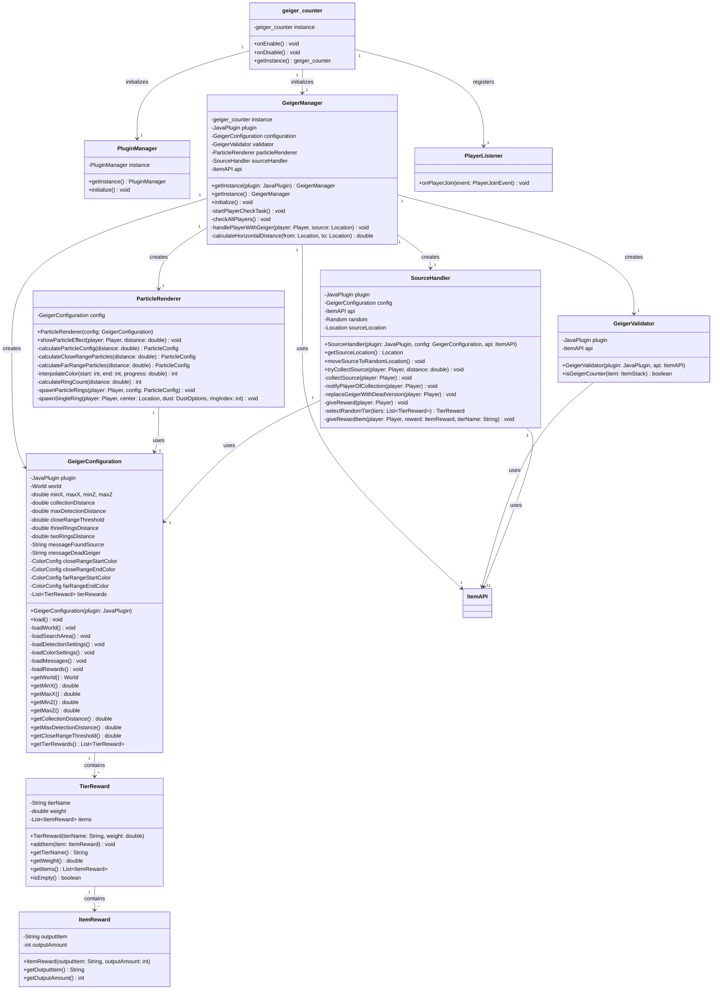

# Geiger Counter

A Minecraft Paper plugin that creates a treasure hunt gameplay mechanic where players use Geiger Counter item to track down a randomly spawning radioactive source for tiered loot rewards.

## Features

- Use **Geiger Counter** item to detect a hidden radioactive source
- Visual particle effects guide players toward the source location
- Particle colors and ring counts change based on distance to source
- Tiered reward system with 6 rarity levels (Common to Mythical)
- Geiger Counter "runs out of charge" after finding the source, becoming a **Dead Geiger Counter**
- Source automatically relocates after being discovered
- Configurable search area, detection ranges, and particle effects
- Fully customizable reward pools with weighted drop chances

## Architecture

The plugin follows a modular architecture with clear separation of concerns:



### Component Descriptions

- **geiger_counter**: Main plugin class that initializes managers and registers event listeners
- **PluginManager**: Singleton manager for plugin-wide initialization
- **GeigerManager**: Central coordinator that manages all Geiger Counter functionality, runs periodic player checks, and coordinates between components
- **GeigerConfiguration**: Configuration loader that reads and provides access to all plugin settings including world bounds, detection ranges, colors, and rewards
- **GeigerValidator**: Validates whether items are Geiger Counters using TLibs item paths
- **ParticleRenderer**: Handles visual particle effects with dynamic colors and ring counts based on distance to the radioactive source
- **SourceHandler**: Manages radioactive source location, collection detection, reward distribution, and Geiger Counter replacement with dead version
- **PlayerListener**: Event listener for player-related events (placeholder for future functionality)
- **TierReward**: Model representing a reward tier with weight and list of possible items
- **ItemReward**: Model representing an individual item reward with path and amount

## Dependencies

| Dependency | Required |
|---|---|
| [Paper](https://papermc.io/) 1.21+ | Yes |
| [TLibs](https://www.spigotmc.org/resources/tlibs.127713/) | Yes |
| [MMOItems](https://www.spigotmc.org/resources/mmoitems-premium.39267/) | No |
| [ItemsAdder](https://itemsadder.com/) | No |

## Installation

1. Place `geiger_counter.jar` into your server's `plugins/` folder
2. Make sure that **TLibs** is also installed. **MMOItems** and **ItemsAdder** are optional
3. Reload the server or enable `geiger_counter-1.0.0` with PlugManX
4. Configure `plugins/geiger_counter/config.yml` as needed
5. The radioactive source will spawn in a random location within the configured area

## Configuration

```yaml
# Source location settings
source:
  world: TFMC_S2          # World where source spawns
  top-left:               # Search area corner 1
    x: -1000.0
    z: -1000.0
  bottom-right:           # Search area corner 2
    x: 1000.0
    z: 1000.0

# Detection settings
detection:
  collection-distance: 20.0           # Distance to collect source (blocks)
  max-detection-distance: 2500.0      # Maximum detection range
  close-range-threshold: 200.0        # Distance threshold for color shift
  ring-thresholds:
    three-rings: 100.0    # 3 rings when closer than this
    two-rings: 300.0      # 2 rings when closer than this (else 1)

# Particle effect colors (RGB: 0-255)
colors:
  close-range:
    start: { red: 255, green: 255, blue: 255 }  # White (closest)
    end: { red: 255, green: 0, blue: 255 }      # Purple (threshold)
  far-range:
    start: { red: 255, green: 0, blue: 255 }    # Purple (threshold)
    end: { red: 17, green: 0, blue: 17 }        # Dark Purple (farthest)

# Reward tiers with weighted chances
drops:
  tier-weights:
    common: 45      # 45%
    uncommon: 30    # 30%
    rare: 15        # 15%
    epic: 7         # 7%
    legendary: 2.5  # 2.5%
    mythical: 0.5   # 0.5%
  
  tiers:
    common:
      - "m.FOODS.SAUSAGE:32"
      - "v.raw_iron_block:32"
      - "ia.tfmc:mythril_ingot"
    uncommon:
      - "m.MATERIALS.ABYSSALITE_FRAGMENT:4"
      - "m.CONSUMABLES.WEAK_REPAIR_KIT:1"
    # ... (see config.yml for full reward lists)

# Messages
messages:
  found-source: "&#AA00FFYou have found the source of Arcane Radiation! &#FFFF00The source has moved."
  dead-geiger: "&7Your Arcane Trace Detector has run out of fuel."
```

### Configuration Options

| Key | Default | Description |
|---|---|---|
| `source.world` | `TFMC_S2` | World name where the radioactive source spawns |
| `source.top-left` / `bottom-right` | ±1000 | Defines rectangular search area bounds |
| `detection.collection-distance` | `20.0` | Distance (blocks) to collect the source |
| `detection.max-detection-distance` | `2500.0` | Maximum range for Geiger Counter detection |
| `detection.close-range-threshold` | `200.0` | Distance where particle colors shift |
| `detection.ring-thresholds` | See above | Distance thresholds for 1, 2, or 3 particle rings |
| `colors.close-range` / `far-range` | See above | RGB colors for particle gradient effect |
| `drops.tier-weights` | See above | Percentage chance for each rarity tier |
| `drops.tiers.*` | See config | Item reward pools for each tier (format: `path:amount`) |
| `messages.found-source` | Success message | Message when player finds the source |
| `messages.dead-geiger` | Break message | Message when Geiger Counter breaks |

## Usage

1. **Obtain a Geiger Counter**: Get the custom item via TLibs/MMOItems/ItemsAdder
2. **Hold the Geiger Counter**: Particle effects will appear showing direction and distance
3. **Follow the Particles**: More rings = closer to source. Color shifts from purple -> white as you approach (can configure)
4. **Find the Source**: Get within 20 blocks (default) to automatically collect it
5. **Receive Rewards**: Get a random item from the tiered loot pool
6. **Geiger Counter Breaks**: The item becomes a Dead Geiger Counter and the source relocates

### Visual Feedback

- **3 Particle Rings**: Within 100 blocks (very close)
- **2 Particle Rings**: Within 300 blocks (close)
- **1 Particle Ring**: Beyond 300 blocks (far)
- **White Color**: Very close (0-200 blocks)
- **Purple -> Dark Purple**: Far away (200-2500 blocks)

## Reward Tiers

| Tier | Weight | Typical Rewards |
|---|---|---|
| **Common** | 45% | Food, basic materials, raw iron |
| **Uncommon** | 30% | Rare fragments, repair kits, research items |
| **Rare** | 15% | Advanced fragments, medium repair kits |
| **Epic** | 7% | Runestones, trial keys, strong repair kits |
| **Legendary** | 2.5% | Legendary materials, magic repair kits, gemstone pouches |
| **Mythical** | 0.5% | Item skin scrolls, mythical pouches, rare currency |

## Author

Justin - TFMC
[Donation Link](https://www.patreon.com/c/TFMCRP)
